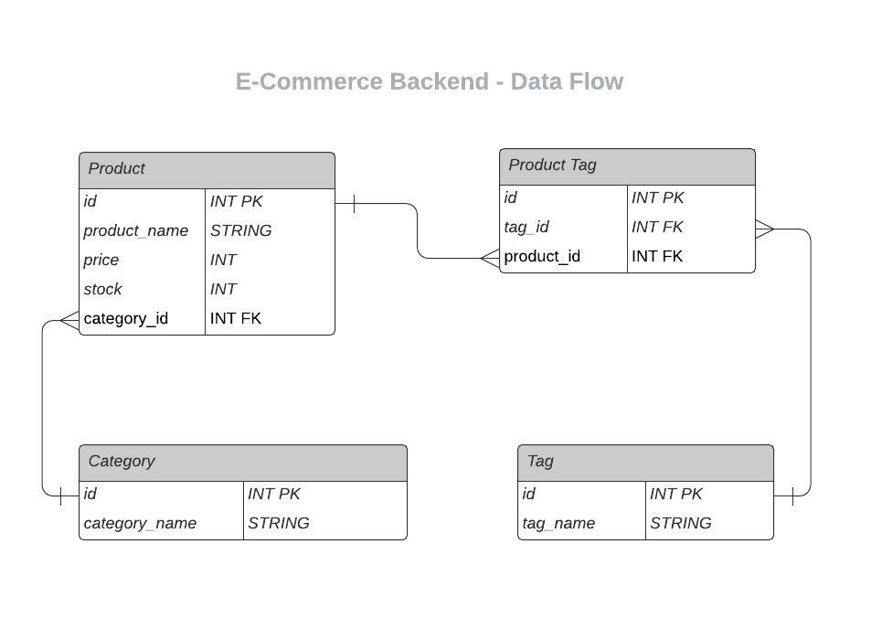

# E-Commerce Backend

# Table of Contents
[Description](#description) - 
[Install](#install) - 
[Usage](#usage) - 
[Technologies](#technologies) -
[Links](#links) - 
[Contact](#contact) - 
[License](#license)

## Description
This app was designed as an e-commerce backend with many different tables in a database. The category table only has two values a name and an id for the category and can be used to associate specific products with a category. The product category stores an id, name, price, stock, and a one to many association for the category id. As categories may have many products but products can only have a single category. The tag table is similar to the category table, however this is used to sort items by what they are similar to and can have a many to many relationship with the product table. For this a fourth table is made to easily identify the relationship between tags and products.

## Install
Please use **'npm i'** in the command line to install the dependencies. This program uses sequelize, mysql2, express, and dotenv.

Before you begin please also update the **'.env.EXAMPLE'** file to include your information for SQL. Then rename the file to **'.env'**. Without this step the program will not run.

Before usage please in a MySQL terminal use **'source db/schema.sql;'**, this will create the database.

Also in the regular node terminal use **'npm run seed'**, this will seed the database with data.

## Usage
When ready use **'npm start'** into the command line to run.

**/api/categories** - This call allows the user to read all and create from the category table
**/api/categories/:id** - By adding an ID to the end it allows the user to update, delete, and read a specific category

**/api/products** - This allow the user to read all and create for the product table
**/api/products/:id** - By adding an ID to the end it allows the user to update, delete, and read a specific product as well

**/api/tags** - This allow the user to read all and create for the tag table
**/api/tags/:id** - By adding an ID to the end it allows the user to update, delete, and read a specific tag as well

## Technologies

## Links
 
[Walkthrough Video](https://youtu.be/IH0zQNwWz6I)  
[GitHub](https://github.com/niklasertle/nje-ecommerce-backend)

## Contact
[GitHub Profile](https://github.com/niklasertle) 
Email: nik.ertle@gmail.com

## License
[MIT License Copyright (c) 2021 niklasertle](LICENSE)
